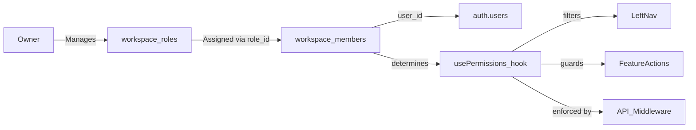

# User Roles & Permissions — Updated Implementation Plan

## DB Investigation Results (Supabase MCP)

`workspace_members` ✅ **already exists** with columns:
- `id`, `workspace_id`, `user_id`, `role` (text, default `'editor'`), `invited_email`, `joined_at`

**Gap:** The `role` column is a plain text string, not linked to a `workspace_roles` table. We need to:
1. Create `workspace_roles` table
2. Add `role_id UUID REFERENCES workspace_roles(id)` to `workspace_members`
3. Keep old `role` text column temporarily for backward compat, then deprecate it

---

## Architecture Overview



---

## Built-in System Roles

| Role | Permissions | Editable? |
|---|---|---|
| **Owner** | Everything — all features, delete workspace, all settings | ✅ Yes (permissions can be viewed but owner always keeps full access) |
| **Co-Owner** | Everything EXCEPT `workspace_delete` | ✅ Yes (all toggles editable) |
| Custom roles | Whatever the owner configures | ✅ Yes |

> [!NOTE]
> Both built-in roles appear in the roles list and can be opened to view/edit their permission toggles. However, deleting them is blocked. The Owner role's `workspace_delete` permission is always `true` and cannot be turned off.

---

## Permission Sections (Trimmed per feedback)

Removed: Trash, Time Tracking, Custom Fields, Snippets (moved under Templates), Activity Feeds

| Section | Permission Keys |
|---|---|
| **Contacts** | `contacts_view`, `contacts_create`, `contacts_edit`, `contacts_delete` |
| **Projects** | `projects_view`, `projects_create`, `projects_edit`, `projects_delete` |
| **Files** | `files_view`, `files_create`, `files_edit`, `files_delete` |
| **Financials** | `financials_view`, `financials_create`, `financials_edit`, `financials_delete` |
| **Proposals** | `proposals_view`, `proposals_create`, `proposals_edit`, `proposals_delete` |
| **Forms** | `forms_view`, `forms_create`, `forms_edit`, `forms_delete` |
| **Schedulers** | `schedulers_view`, `schedulers_create`, `schedulers_edit`, `schedulers_delete` |
| **Templates** | `templates_view`, `templates_create`, `templates_edit`, `templates_delete` |
| **Archive** | `archive_view`, `archive_restore` |
| **Settings** | `settings_workspace`, `settings_branding`, `settings_domains`, `settings_payments`, `settings_emails`, `settings_roles` |
| **Navigation** | `nav_contacts`, `nav_projects`, `nav_files`, `nav_financials`, `nav_proposals`, `nav_forms`, `nav_schedulers`, `nav_templates`, `nav_archive` |

---

## Proposed Changes

---

### Phase 1 — Database Migration

#### Migration: `add_workspace_roles_and_member_role_id`

```sql
-- 1. Create workspace_roles
CREATE TABLE IF NOT EXISTS workspace_roles (
  id            UUID PRIMARY KEY DEFAULT gen_random_uuid(),
  workspace_id  UUID NOT NULL REFERENCES workspaces(id) ON DELETE CASCADE,
  name          TEXT NOT NULL,
  is_system     BOOLEAN DEFAULT false,   -- true = Owner / Co-Owner (can't delete)
  permissions   JSONB NOT NULL DEFAULT '{}',
  created_at    TIMESTAMPTZ DEFAULT NOW()
);

ALTER TABLE workspace_roles ENABLE ROW LEVEL SECURITY;

CREATE POLICY "workspace_roles: workspace owner full access"
  ON workspace_roles FOR ALL
  USING (
    workspace_id IN (SELECT id FROM workspaces WHERE owner_id = auth.uid())
  );

-- 2. Add role_id FK to workspace_members
ALTER TABLE workspace_members
  ADD COLUMN IF NOT EXISTS role_id UUID REFERENCES workspace_roles(id) ON DELETE SET NULL;
```

---

### Phase 2 — Types & `useRolesStore`

#### [NEW] `src/types/roles.ts`

```ts
export interface WorkspaceRole {
  id: string;
  workspace_id: string;
  name: string;
  is_system: boolean;
  permissions: Record<string, boolean>;
  created_at: string;
}

export interface WorkspaceMemberWithRole {
  id: string;
  workspace_id: string;
  user_id: string | null;
  invited_email: string | null;
  role_id: string | null;
  role?: WorkspaceRole | null;
  joined_at: string | null;
}
```

#### [NEW] `src/store/useRolesStore.ts`

Zustand store:
- `roles: WorkspaceRole[]`
- `members: WorkspaceMemberWithRole[]`
- `fetchRoles(workspaceId)` — loads from `workspace_roles`, auto-creates Owner + Co-Owner if none exist
- `createRole(workspaceId, name, basePermissions?)` — insert with `is_system: false`
- `updateRole(id, updates)` — optimistic + DB persist
- `deleteRole(id)` — blocked if `is_system = true`; moves members to null role
- `duplicateRole(id)` — clone with "Copy of …" name
- `fetchMembers(workspaceId)` — loads `workspace_members` joined with `workspace_roles`
- `updateMemberRole(memberId, roleId)` — updates `role_id` on the member row

---

### Phase 3 — Settings Page: Roles

#### [MODIFY] `src/components/settings/SettingsSidebar.tsx`
Add a new **"Team"** section in the sidebar with a single link:
```ts
{ name: 'User Roles', href: '/settings/roles', icon: ShieldCheck }
```

#### [MODIFY] `src/app/settings/layout.tsx`
- Add title mapping: `'/settings/roles'` → `'User Roles'`
- Include the new link in mobile `allLinks`

#### [NEW] `src/app/settings/roles/page.tsx`

Roles list page — **must match the existing settings page UI pattern** (same as Workspace, Payments, etc. pages — using `SettingsCard`, same padding/layout):

- **Info card** (using the same `SettingsCard` with a hint/info variant that matches the app) explaining roles
- **"+ New Role" button** — matches existing primary action button style in settings pages
- **Roles list** — each role as a card row with:
  - Role name
  - Member count badge (e.g., "3 members")
  - System badge for Owner / Co-Owner
  - Edit button → navigates to `/settings/roles/[roleId]`
  - Delete button (hidden for system roles)
- **Bottom reset section** matching existing pattern

#### [NEW] `src/app/settings/roles/[roleId]/page.tsx`

Role detail page — split layout matching existing settings pages:
- **Header section** (using `SettingsCard`): Role name (editable inline text), member count
- **Permission sections** — each feature as a collapsible `SettingsCard` row:
  - Header: feature name + section-level toggle (enable/disable ALL permissions for this section at once)
  - Expanded: individual action toggles (View, Create, Edit, Delete) displayed as rows
- No color picker

#### [NEW] `src/components/roles/PermissionSection.tsx`

A single collapsible permission section matching the app's `SettingsCard` style:
- Header row: feature icon + name + master toggle on right (collapses/expands)
- Body: list of `PermissionRow` items

#### [NEW] `src/components/roles/PermissionRow.tsx`

A single permission toggle row:
- Left: action label (e.g., "View", "Create", "Edit", "Delete")
- Right: toggle switch — using the same toggle component used elsewhere in the app settings

#### [NEW] `src/components/roles/CreateRoleModal.tsx`

Modal using existing modal patterns:
- Role name input
- Optional: "Copy permissions from existing role" dropdown
- Create button

---

### Phase 4 — Role Assignment in Contact Edit Panel

#### [MODIFY] Contact / Client edit panel or right panel

The user specified: **"we need ability to choose the role from inside the contact edit panel".**

This means workspace **members** (people who have `workspace_members` rows) can have their role changed directly when editing a contact who is also a member.

Implementation:
- In the contact right panel / edit drawer, detect if `client.email` matches a `workspace_members.invited_email` or the user's auth email
- If a match is found, show a **"Workspace Role"** field with a dropdown/select listing all `workspace_roles` for this workspace
- On change → call `useRolesStore.updateMemberRole(memberId, roleId)`

---

### Phase 5 — `usePermissions` Hook

#### [NEW] `src/hooks/usePermissions.ts`

```ts
// Returns whether the current user can perform an action
const { can, role, isOwner } = usePermissions();

can('contacts_create')  // → boolean
can('projects_delete')  // → boolean
```

Logic:
1. Get `activeWorkspaceId` from `useUIStore`
2. Get `user.id` from `useAuthStore`
3. Check `workspaces.owner_id === user.id` → if owner, return `true` for all (bypass)
4. Look up the user's `workspace_members` row → get `role_id`
5. Find the matching `WorkspaceRole` → read `permissions[key]`
6. Return boolean

---

### Phase 6 — Enforcement

#### A) Left Nav — [MODIFY] `src/store/useMenuStore.ts` + `LeftSystemMenu.tsx`

In `LeftSystemMenu`, after loading `navItems`, filter through `usePermissions()`:

```ts
const visibleItems = navItems.filter(item => {
  const navKey = NAV_PERMISSION_MAP[item.id]; // e.g. 'nav_contacts'
  if (!navKey) return true; // custom links always show
  return can(navKey);
});
```

#### B) API Middleware — [NEW] `src/middleware.ts` (or extend if exists)

Check permission on protected API routes. Pattern:
1. Get user session from cookie
2. Fetch member role from DB
3. Evaluate permission key for the route
4. Return 403 if denied

Key routes to protect:
- `POST /api/clients` → requires `contacts_create`
- `DELETE /api/clients/[id]` → requires `contacts_delete`
- `POST /api/projects` → requires `projects_create`
- `DELETE /api/projects/[id]` → requires `projects_delete`
- `POST/PUT /api/invoices` → requires `financials_create/edit`
- `POST/PUT /api/proposals` → requires `proposals_create/edit`

#### C) Feature Actions — UI Guards

| Location | Guard |
|---|---|
| `RowContextMenu.tsx` | Hide "Edit"/"Delete" items based on resource type + `can()` |
| Create buttons on list pages | `{can('contacts_create') && <CreateButton />}` |
| Settings sidebar links | Filter links the member has no `settings_*` permission for |

---

### Phase 7 — RLS Policies (Supabase)

Add RLS policies on `workspace_roles` so only the workspace owner and members with `settings_roles` permission can read/write:

```sql
-- Members can read their workspace's roles
CREATE POLICY "members read workspace roles"
  ON workspace_roles FOR SELECT
  USING (
    workspace_id IN (
      SELECT workspace_id FROM workspace_members WHERE user_id = auth.uid()
    )
    OR
    workspace_id IN (SELECT id FROM workspaces WHERE owner_id = auth.uid())
  );
```

---

## Execution Order

1. `[ ]` DB migration: `workspace_roles` table + `role_id` FK on `workspace_members`
2. `[ ]` RLS policies on `workspace_roles`
3. `[ ]` `src/types/roles.ts` — types
4. `[ ]` `src/store/useRolesStore.ts` — store with auto-seed of Owner + Co-Owner
5. `[ ]` `src/components/settings/SettingsSidebar.tsx` — add "User Roles" link
6. `[ ]` `src/app/settings/layout.tsx` — title + mobile link
7. `[ ]` `src/app/settings/roles/page.tsx` — roles list
8. `[ ]` `src/components/roles/CreateRoleModal.tsx`
9. `[ ]` `src/app/settings/roles/[roleId]/page.tsx` — role detail with permissions
10. `[ ]` `src/components/roles/PermissionSection.tsx` + `PermissionRow.tsx`
11. `[ ]` Contact edit panel — role assignment field
12. `[ ]` `src/hooks/usePermissions.ts`
13. `[ ]` `LeftSystemMenu.tsx` — nav filtering
14. `[ ]` `RowContextMenu.tsx` — action guards
15. `[ ]` API middleware — route protection
16. `[ ]` Verify: create role → assign to member → confirm nav items disappear

---

## Verification Plan

- Create a "Designer" role with no Financials access → confirm Invoices nav item hidden
- Create a "Co-Owner" role → confirm all features editable, workspace delete blocked
- Assign role from Contact edit panel → confirm immediate effect
- Hit `POST /api/invoices` as a member with no `financials_create` → confirm 403
- Check Owner always bypasses permission checks
